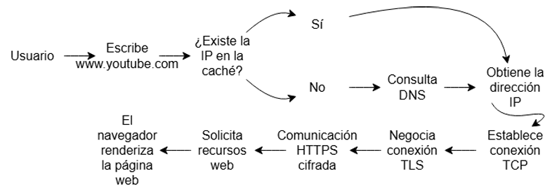
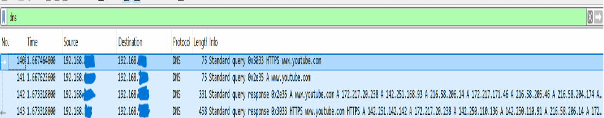
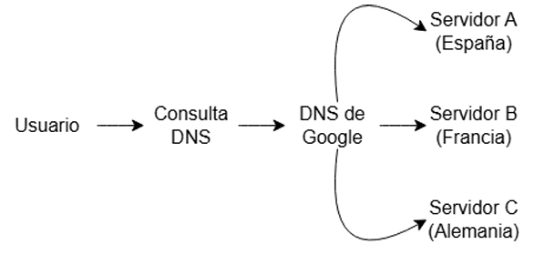
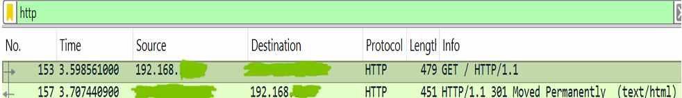
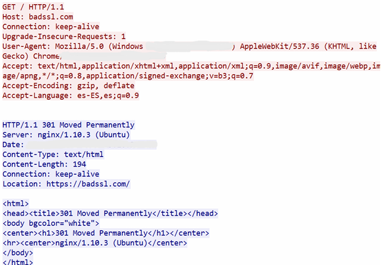
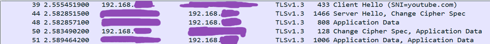
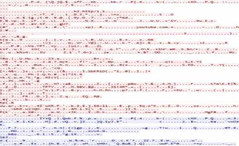

# Wireshark – HTTP, HTTPS & DNS Analysis

Análisis técnico y práctico del tráfico de red utilizando el analizador de paquetes Wireshark para auditar el comportamiento de los protocolos esenciales en la navegación web, evaluar las propiedades de confidencialidad en tránsito y contrastar la seguridad entre flujos de datos en texto plano y cifrados.

---

## Objetivo

Comprender y analizar los procesos internos que ocurren en la pila de protocolos TCP/IP durante una sesión de navegación web. El análisis se enfoca en auditar la transferencia de paquetes a través de Wireshark, identificar la interacción de las peticiones locales con los servidores y evaluar qué información sensible puede quedar expuesta ante un tercero si no se implementan mecanismos de cifrado adecuados.

---

## Herramientas Utilizadas

* **Wireshark Packet Analyzer:** Herramienta especializada para la captura, inspección y análisis de paquetes de datos en la interfaz de red.

* **Línea de Comandos (CLI / CMD):** Utilizada para la preparación del entorno mediante el vaciado preventivo de la caché DNS local con el comando `ipconfig /flushdns`. Este paso permite iniciar la captura desde una consulta DNS y evitar, en la medida de lo posible, que una resolución almacenada previamente impida observar una nueva consulta en la red.

---

## Funcionamiento General de una Búsqueda Web (HTTPS)

Aunque para un usuario abrir una página web parece una acción instantánea, internamente intervienen numerosos protocolos que trabajan conjuntamente. Normalmente, antes de iniciar la conexión con el servidor web, el sistema necesita resolver el nombre de dominio para obtener una dirección IP. Esta resolución puede no aparecer en la captura si la información ya se encuentra almacenada en la caché local u otro mecanismo de resolución.

El proceso general observado durante una navegación HTTPS puede resumirse de la siguiente forma:

1. El cliente necesita resolver el nombre de dominio mediante DNS.
2. El servidor DNS devuelve una o varias direcciones IP asociadas al dominio.
3. El cliente establece la comunicación con el servidor web.
4. Si se utiliza HTTP, la información se transmite sin cifrado.
5. Si se utiliza HTTPS, se establece previamente una sesión TLS.
6. Una vez completada la negociación TLS, la información de aplicación se transmite cifrada.

### Evidencia Visual: Funcionamiento general

---

## Captura y Análisis Práctico de Protocolos

> **Nota sobre Privacidad y OPSEC:** Como buena práctica de seguridad y gestión de infraestructura, todas las capturas de pantalla utilizadas en este análisis han sido parcialmente anonimizadas. Se han ocultado identificadores innecesarios, como direcciones MAC y el direccionamiento IP privado real del entorno de pruebas, para evitar exponer información de la infraestructura local en un repositorio público.

---

## Captura y Análisis DNS (Resolución de Nombres)

Como el ordenador todavía desconoce dónde se encuentra el servidor web, normalmente necesita realizar una consulta DNS antes de iniciar la conexión. Al utilizar el filtro `dns` en Wireshark, podemos observar y analizar este proceso.

En la captura se observa que el equipo cliente `192.168.X.X` envía una consulta DNS hacia el servidor DNS local o gateway indicado en la captura para solicitar la dirección IPv4 asociada al dominio. Cuando se solicita una dirección IPv4 se utiliza un registro de tipo **A**. En el caso de necesitar una dirección IPv6, la consulta correspondiente sería de tipo **AAAA**.

### Evidencia Visual 1: Resolución DNS en Wireshark

La respuesta DNS puede contener varias direcciones IP asociadas al mismo dominio. En servicios de gran escala, disponer de múltiples direcciones puede facilitar la distribución de las conexiones entre diferentes infraestructuras.

Para conseguirlo pueden utilizarse diferentes mecanismos de distribución, como **Round-Robin**, **GeoDNS**, sistemas basados en latencia o mecanismos de disponibilidad y selección de servidores.

### Evidencia Visual 1.1: Balanceo de carga mediante DNS

El análisis de la consulta DNS también permite comprobar qué servidor está realizando la resolución. Si apareciera un servidor DNS desconocido o una respuesta con una dirección IP manipulada, podría existir una configuración incorrecta o una posible manipulación de las respuestas DNS.

Entre las técnicas relacionadas se encuentran el **DNS Spoofing** y el **DNS Cache Poisoning**, que pueden provocar que el usuario sea dirigido hacia una dirección IP o servidor diferente del esperado.

---

## Análisis HTTP (Tráfico en Texto Plano)

Al aislar el tráfico HTTP mediante el filtro `http` de Wireshark, se observa al navegador realizando una petición inicial `GET` para solicitar el contenido del dominio utilizado en la práctica.

El servidor responde con el código **301 Moved Permanently**, indicando mediante la cabecera `Location` la dirección hacia la que debe continuar la navegación utilizando HTTPS. El navegador interpreta esta respuesta y realiza posteriormente la petición correspondiente mediante HTTPS.

### Evidencia Visual 2: Petición HTTP GET y respuesta 301

Esta captura permite comprobar directamente cómo se produce la primera comunicación HTTP y cómo el servidor solicita al navegador continuar la navegación mediante HTTPS.

Si la comunicación continuase utilizando HTTP, los datos viajarían sin el mecanismo de confidencialidad proporcionado posteriormente por TLS. Esto significa que determinados elementos de la comunicación podrían ser observados mediante técnicas de captura de tráfico.

Una forma de comprobarlo en Wireshark es utilizar la función <i>Follow TCP Stream</i>. Esta función reconstruye la conversación perteneciente al flujo TCP seleccionado y permite visualizar el contenido que ha sido transmitido.

### Evidencia Visual 2.1: Follow TCP Stream en HTTP

El resultado demuestra visualmente una de las principales diferencias de HTTP frente a HTTPS: cuando la aplicación transmite información sin cifrado, el contenido de la comunicación puede resultar directamente interpretable para alguien que consiga capturar el tráfico.

### Riesgo de Privacidad: Fingerprinting

Las cabeceras HTTP también pueden proporcionar información adicional sobre el cliente. Entre ellas se encuentra `Host`, que indica el dominio solicitado, y `User-Agent`, que proporciona información sobre el navegador y determinados datos de la plataforma utilizada.

Estos datos pueden contribuir a realizar técnicas de <i>Fingerprinting</i>, mediante las cuales un atacante puede recopilar diferentes características técnicas del cliente para intentar identificarlo o conocer qué software utiliza.

---

## Análisis HTTPS/TLS (Tráfico Cifrado)

Tras la redirección desde HTTP, se inicia la comunicación protegida mediante TLS. En Wireshark, este tráfico puede analizarse utilizando el filtro `tls`.

HTTPS puede entenderse como HTTP transmitido utilizando TLS como mecanismo de protección. TLS proporciona mecanismos de autenticación, confidencialidad e integridad para la comunicación.

Durante la fase inicial de negociación, conocida como <b>Handshake</b>, aparecen mensajes como `Client Hello` y `Server Hello`. El cliente propone las opciones criptográficas que soporta y el servidor selecciona las utilizadas para establecer la sesión.

Durante este proceso también se transmite el certificado digital del servidor, que permite al cliente verificar su identidad mediante la correspondiente cadena de confianza.

### Evidencia Visual 3: Handshake TLS y tráfico cifrado

Una vez completada la negociación y establecidas las claves necesarias para la sesión, aparecen paquetes de datos de aplicación protegidos. En Wireshark, el contenido de estos paquetes no puede interpretarse directamente porque se encuentra cifrado.

Al utilizar <i>Follow TCP Stream</i> sobre esta comunicación, el resultado ya no presenta una conversación HTTP legible como ocurría anteriormente. El contenido aparece como datos cifrados, ya que Wireshark no dispone de las claves de sesión necesarias para descifrarlo.

### Evidencia Visual 3.1: Follow TCP Stream en HTTPS

La comparación entre ambas capturas permite observar de forma práctica la diferencia fundamental entre los dos escenarios: mientras que el contenido HTTP puede reconstruirse y visualizarse en texto legible, el contenido protegido mediante TLS no puede interpretarse directamente sin las claves necesarias.

---

## Diferencias Encontradas y Coexistencia de Protocolos

| Atributo Técnico / Propiedad | Protocolo HTTP | Protocolo HTTPS (sobre TLS) |
| :--- | :---: | :---: |
| **Puerto de Red por Defecto** | 80 | 443 |
| **Cifrado de Capa Activo** | No | Sí |
| **Garantía de Confidencialidad e Integridad** | No | Sí |
| **Autenticación mediante Certificado Digital** | No | Sí |
| **Filtro de Localización en Wireshark** | `http` | `tls` |
| **Lectura de Carga Útil en *TCP Stream*** | Texto plano legible | Contenido cifrado |
| **Exposición del Contenido ante *Sniffing*** | Alta | Reducida |

### ¿Por qué sigue existiendo HTTP hoy en día?

A pesar de las ventajas de seguridad proporcionadas por HTTPS, HTTP continúa utilizándose en determinados escenarios. Entre ellos se encuentran la compatibilidad con dispositivos antiguos, determinados entornos de desarrollo y pruebas internas, así como las situaciones en las que un servidor HTTP recibe inicialmente la petición y responde con una redirección hacia HTTPS.

---

## Aprendizajes Clave del Laboratorio

- **DNS:** La resolución de nombres es un paso fundamental para localizar los servicios antes de establecer la comunicación con el servidor web. El análisis de las consultas DNS permite observar dominios solicitados, tipos de registro y direcciones IP devueltas.

- **HTTP:** El análisis mediante Wireshark demuestra que una comunicación HTTP puede ser reconstruida mediante `Follow TCP Stream` y presentar información en texto legible, lo que evidencia la ausencia de confidencialidad en este protocolo.

- **HTTPS/TLS:** La utilización de TLS protege el contenido de la comunicación mediante cifrado. Aunque Wireshark continúa permitiendo observar información como direcciones IP, puertos y mensajes del protocolo TLS, el contenido de aplicación permanece protegido sin las claves de sesión.

- **Análisis de tráfico:** La comparación entre HTTP y HTTPS permite comprobar de forma práctica cómo el cifrado modifica la visibilidad de la información durante una captura de red.

- **Seguridad:** El laboratorio demuestra que cifrar las comunicaciones es fundamental para proteger la confidencialidad de los datos, aunque determinados metadatos y patrones de tráfico continúen siendo observables.

